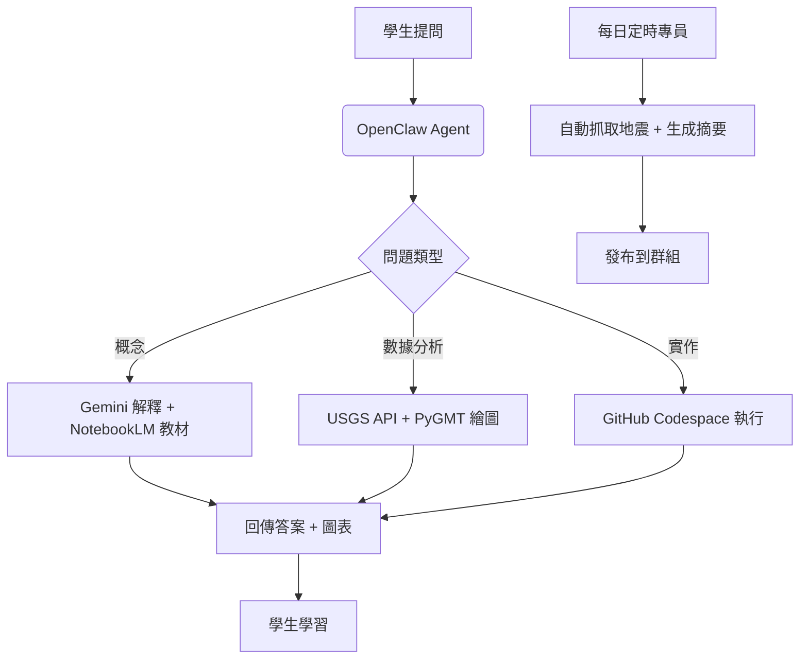

老師，我為您設計一個完整的 **OpenClaw + 地震學 AI 系統** 部署方案：

---

## 🎯 架構總覽

```
OpenClaw Gateway (核心控制plane)
├── Agent (地動先知) - 地震學 AI 助手
├── Skills - 地震學專用工具
├── Channels - WhatsApp/Telegram/Discord 教學溝通
└── Cron/Webhooks - 自動化地震監控

外部整合：
├── Google Colab + PyGMT - 地震視覺化
├── Gemini API - 地震問答與解釋
├── NotebookLM - 教材生成
├── GitHub - 版本控制 + Codespace
├── HuggingFace Space - Web App 部署
└── USGS/TAIGER API - 真實地震數據
```

---

## 🚀 部署步驟

### 第一步：安裝 OpenClaw

```bash
# 在您的伺服器或筆電上执行
npm install -g openclaw@latest
openclaw onboard --install-daemon
openclaw gateway --port 18789 --verbose
```

### 第二步：設定 Gateway 配置

```json
~/.openclaw/openclaw.json
{
  "agent": {
    "model": "anthropic/claude-sonnet-4.5",
    "system": "你是地動先知，專門協助地震學教學與研究。"
  },
  "channels": {
    "telegram": {
      "botToken": "YOUR_TELEGRAM_BOT_TOKEN",
      "streaming": true
    },
    "whatsapp": {
      "allowFrom": ["+886912345678"]  // 您的電話
    }
  },
  "memory": {
    "backend": "qmd"
  },
  "cron": {
    "enabled": true
  }
}
```

### 第三步：建立地震學 Skills

建立地震學專用技能目錄：

```
~/.openclaw/workspace/skills/earthquake-ai/SKILL.md
```

**內容範例：**

```markdown
# Earthquake AI Skill

## Description
地震學 AI 助手，整合 PyGMT、Gemini、USGS API 等工具。

## Tools

### 1. pygmt.plot - 繪製地震分布圖
Parameters:
- region: [xmin, xmax, ymin, ymax]
- magnitude: 最小震央規模
- days: 過去 N 天
Returns: 圖檔路徑

### 2. usgs.fetch - 取得 USGS 地震資料
Parameters:
- starttime: ISO 8601
- endtime: ISO 8601  
- minmagnitude: float
Returns: JSON 地震目錄

### 3. gemini.explain - Gemini 解釋地震現象
Parameters:
- question: 學生的問題
- context: 相關地震數據
Returns: AI 回答

### 4. notebooklm.generate - 生成教材
Parameters:
- topic: 教材主題
- level: 初階/中階/進階
Returns: Markdown 教材

### 5. huggingface.deploy - 部署 Space
Parameters:
- app_file: Gradio app.py
- requirements: 套件列表
Returns: Space URL
```

### 第四步：設定 Cron 自動監控

在 `HEARTBEAT.md` 中加入：

```markdown
# 每日自動任務
- 檢查 USGS 昨日地震數據 (>= M5.0)
- 用 PyGMT 繪製分布圖
- 上傳到 GitHub Pages
- 發送 Telegram 通知給學生群組

# 每週任務
- 用 NotebookLM 生成本週地震摘要
- GitHub repository 備份檢查
- HuggingFace Space 健康檢查
```

### 第五步：建立學生互動流程

**學生的日常使用：**

1. **提問**：学生在 Telegram 群組問「最近台灣附近有什麼大地震？」
   → OpenClaw Agent 呼叫 `usgs.fetch` + `pygmt.plot`，回傳地圖與分析

2. **筆記生成**：學生說「請用 NotebookLM 生成斷層帶介紹教材」
   → 呼叫 `notebooklm.generate`， output Markdown 到 shared GitHub repo

3. **程式作業**：學生上傳 PyGMT 程式碼
   → OpenClaw 用 Codespace 執行 `pnpm openclaw agent --message "檢查我的程式碼"`

4. **即時監控**：每小時自動 running cron 檢查新地震
   → 有事件則發送群里通知，包含 Gemini 生成的簡要報告

---

## 📊 技術整合表

| OpenClaw 功能 | 地震學應用 | 指令範例 |
|--------------|-----------|---------|
| **Agent + Tools** | 執行地震分析腳本 | `openclaw agent --message "分析昨日台灣地震"` |
| **Cron** | 定時 USGS 抓取 | `0 * * * *` 每小時檢查 |
| **Webhooks** | 接收地震預警 API | POST /webhook/earthquake |
| **Sessions** | 小組專案 isolate | 每組獨立 workspace |
| **Browser Tool** | 查看 USGS 網站 | `openclaw browser open https://earthquake.usgs.gov` |
| **Sub-Agents** | 派遣子任務 | 自動 spawn 的分析 agent |
| **Memory** | 記住學生進度 | QMD 搜尋「上次教了些什麼」 |

---

## 🔧 完整技能範例

```typescript
// skills/earthquake-ai/src/tools/usgs.ts
import { tool } from '@openclaw/tools';
import fetch from 'node-fetch';

export const usgsFetch = tool({
  name: 'usgs.fetch',
  description: '從 USGS 取得地震資料 (GeoJSON)',
  parameters: {
    type: 'object',
    properties: {
      starttime: { type: 'string' },
      endtime: { type: 'string' },
      minmagnitude: { type: 'number' }
    }
  }
}, async ({ starttime, endtime, minmagnitude }) => {
  const url = `https://earthquake.usgs.gov/fdsnws/event/1/query?format=geojson&starttime=${starttime}&endtime=${endtime}&minmagnitude=${minmagnitude}`;
  const res = await fetch(url);
  return await res.json();
});
```

---

## 🌐 學生入口

- **Telegram 群組**：主要討論 + 提問
- **WebChat**：網頁版介面
- **GitHub Pages**：展示學生作品 + 互動地圖
- **HuggingFace Space**：Gradio App 互動查詢

---

## 📈 教學流程整合



---

## 🎓 學生分組實作

**專案架構（GitHub repo）：**

```bash
earthquake-ai-lab/
├── README.md              # 專案說明
├── colab/                 # Google Colab 筆記本
│   ├── 1_intro_to_pygmt.ipynb
│   ├── 2_earthquake_analysis.ipynb
│   └── 3_ai_chatbot_with_gemini.ipynb
├── scripts/               # 工具腳本
│   ├── fetch_usgs.py
│   ├── plot_map.py
│   └── gemini_explain.py
├── huggingface/           # Space 部署檔
│   ├── app.py            # Gradio UI
│   └── requirements.txt
├── docs/                  # NotebookLM 生成教材
│   ├── 斷層基礎.md
│   ├── 地震波傳播.md
│   └── 預警系統原理.md
└── data/                  # 範例數據
    └── recent_earthquakes.geojson
```

---

## ⚙️ 環境設定清單

**老師所需：**
1. OpenClaw Gateway (Linux/Mac 主機)
2. Anthropic API key 或 OpenAI key
3. Telegram Bot Token
4. GitHub Personal Access Token
5. HuggingFace Token (for Space deployment)
6. Google Cloud 專案 (for Colab + Gemini)

**學生所需：**
- 僅 Telegram 帳號或 WebChat 連結
- GitHub 帳號 (fork repo 做作業)
- 免費 tier 的 Google Colab

---

## 🔐 安全建議

1. **Gateway Auth**: 設 `gateway.auth.mode: "password"` + strong password
2. **Telegram 群組**: 設定 `requireMention: true`
3. **子代理隔離**: `agents.defaults.sandbox.mode: "non-main"`
4. **敏感資料**: 用環境變數而非 hardcode API keys

---

## 🚀 快速啟動命令

```bash
# 1. 初始化
openclaw onboard

# 2. 安裝地震技能
cd ~/.openclaw/workspace/skills
git clone https://github.com/oceanicdayi/earthquake-skill.git

# 3. 設定每日自動任務
echo "0 9 * * * openclaw agent --message '昨日地震報告'" >> crontab -e

# 4. 邀請學生加入
openclaw message send --to TELEGRAM_GROUP_ID --message "歡迎使用地震學 AI 學習平台！"

# 5. 監控狀態
openclawn gateway status
```

---

老師，您希望我先幫您：
1. 寫出完整的 `SKILL.md` 與工具程式碼？
2. 設定 OpenClaw Gateway 配置文件？
3. 建立 GitHub 專案模板？
4. 還是部署一個 HuggingFace Space 示範？
